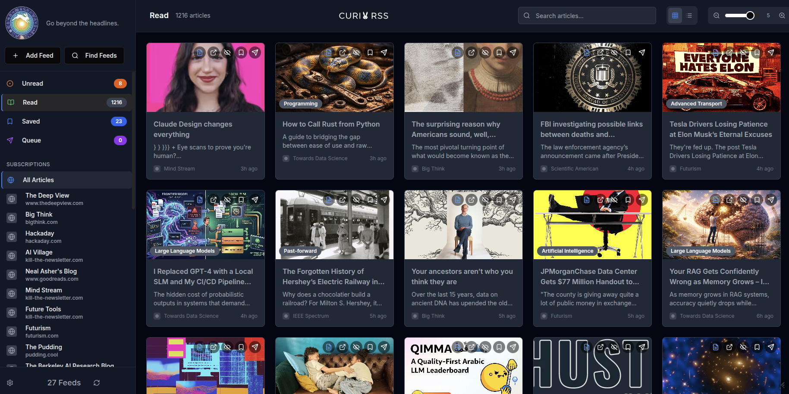

# Curi RSS Reader

[](https://github.com/jlowder/Curi-RSS/blob/main/LICENSE)
[](https://github.com/jlowder/Curi-RSS)
[](https://github.com/jlowder/Curi-RSS/actions/workflows/publish.yml)
[](https://www.docker.com/)
[](https://www.typescriptlang.org/)
[](https://react.dev/)
[](https://www.sqlite.org/)

A full-stack RSS Reader application with AI-powered features.

## Preview


*The Curi RSS Reader interface showing article feed, AI features panel, and article detail view.*

## Getting Started

### Prerequisites

- [Docker](https://docs.docker.com/get-docker/)
- [Docker Compose](https://docs.docker.com/compose/install/)

### Running with Docker Compose

To build and start the application, run the following command in the project root:

```bash
docker compose up --build -d
```

The application will be available at `http://localhost:7016`.

### Applying Updates

If you have made changes to the source code and want to see them in the running container, you must rebuild the image:

```bash
docker compose build --no-cache
docker compose up -d
```

### Running from GHCR

You can also run the application directly from the GitHub Container Registry (GHCR) without building locally:

1. **Create a Docker named volume** (required for data persistence):
   ```bash
   docker volume create rss_data
   ```

2. **Pull and run the image**:
   ```bash
   docker run -d \
     -p 7016:7016 \
     -v rss_data:/app/data \
     ghcr.io/jlowder/curi-rss:main
   ```

The application will be available at `http://localhost:7016`.

## AI Features

This application includes AI-powered features for articles:
- **AI Summary**: Generates a summary of the article.
- **Referenced Information**: Extracts and explains referenced entities.
- **Deep Research**: Generates research prompts based on the article.
- **Counterpoints**: Generates alternative perspectives or counterarguments to the article content.
- **AI Discuss**: An interactive chat interface to discuss the article content.

### Enabling AI Features

To use AI features, you must configure an LLM provider:
1. Open the application in your browser.
2. Click on the **Settings** (cog icon) in the sidebar.
3. Go to the **LLM Configuration** section.
4. Toggle **Enable LLM features**.
5. Provide your **LLM Endpoint** (e.g., `https://api.openai.com/v1`) and **API Key**.
6. (Optional) Enable/disable each AI function, and customize the prompt used for it.
7. Click **Save Changes**.

Once enabled, AI buttons will appear in the article detail view for every enabled feature.

## Development

If you prefer to run the application locally for development:

1. Install dependencies:
   ```bash
   npm install
   ```
2. Start the development server:
   ```bash
   npm run dev
   ```
   The development server runs on port 7016.

### Testing

The project includes both unit/integration tests and end-to-end (E2E) tests.

#### Unit and Integration Tests

The backend logic and storage layer are tested using [Vitest](https://vitest.dev/).

```bash
npm run test
```

#### End-to-End (E2E) Tests

Frontend layout and usability are tested using [Playwright](https://playwright.dev/). These tests verify that the settings dialog is fully functional and that articles remain scrollable.

Before running E2E tests for the first time, install the required browsers:

```bash
npx playwright install chromium
```

To run the E2E tests:

```bash
npm run test:e2e
```

The E2E tests will automatically start the development server if it's not already running.
